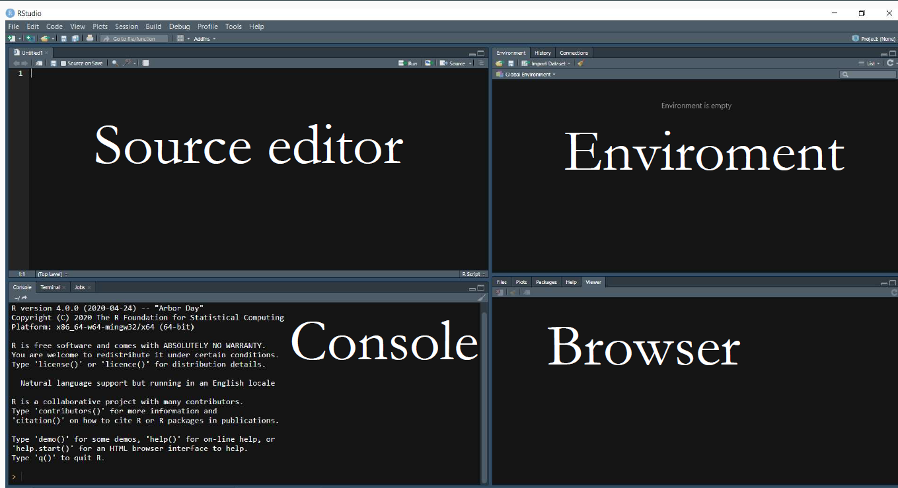

---
title: "Intro a R"
author: "Rodrigo Negrete Pérez"
date: \today

theme: "CambridgeUS"
colortheme: 'beaver'
output: 
  beamer_presentation:
    slide_level: 2
    toc: true
---

```{r setup, include=FALSE}
knitr::opts_chunk$set(echo = TRUE)
```


## Inspiración de los labs. 
A grandes razgos, baso estos labs en tres fuentes/profesores:

* Mauricio Romero (Profesor de Economía del ITAM)
  + https://mauricio-romero.com/teaching/microeconometria-aplicada-otono-2021/
* Nick Huntington (Profesor en quien se apoyó Mauricio)
  + https://nickchk.com/econometrics.html#learnR
* Curso de MPA de Adrián Lucardi-> Eventualmente lo llevarán. 
* R for Data Science de Hadley Wickham y Garret Grolemund

Animo a checar estas fuentes ante cualquier inquietud adicional. 

# Material de los labs

## Github
Todo el material de apoyo de los labs estará en Github.

* rodrigonp/Curso_R
  
# Estructura de los labs

## Introducción a R
El curso están pensados para principiantes en programación. Tres sesiones:

* Nociones básicas del lenguaje: data frames, funciones base
* Análisis de datos (Dplyrs)
* Ggplot

Cualquiera que quiera aprender R puede asistir. 


## MPA

* Mucho de lo que vamos a ver lo van a cubrir en MPA
* Si ya lo vieron, sirve para repasar, profundizar o resolver dudas
* Para los que son de MPA recomiendo ver la presentación Como_pros en el Github si es que ya saben R
* Les puedo asistir con dudas puntuales o con sus tareas. 

# ¿Qué es R?

## Lenguaje orientado a objetos

A grandes razgos, con R podemos: 

* Crear objetos
* Manipular objetos
* Ver objetos

¿Qué es un objeto? 
En nuestro caso, todo lo relacionado a datos: variables, observaciones, regresiones, tablas de regresión. 

## ¿Por qué R?

* Gratis: todo mundo lo usa, hasta autores. 
* Como con la gramática: aprendes uno y entiendes el resto (parecido a Python)
* Replicabilidad

# Interfaz


## Consola

* Podemos ejecutar código aquí, sin embargo, no se guarda
* Muestra los errores en otro color (QUE SIEMPRE HAY QUE LEER)
* Muestras las advertencias (warnings). 

## Errores vs Warnigns

* Los errores impiden que R corra el código
  + Dividimos sobre 0
  + Queremos sacar el promedio de una palabra

* Los Warnings son avisos: R pudo correr el código, pero hay algo sospechoso  


## Environment

Destacan el environment y y el historial 

* El historial es un registro del código corrido 
* El environment es un registro de los objetos que hemos creado
 + Podemos borrarlo con rm(list=ls()) o con la escobita
 
## Navegador

* Podemos ver archivos y paquetes instalados
* PANEL DE AYUDA
* Gráficas

## Source 
A pesar de que el código se puede ejecutar en la consola, aquí deberían trabajar el código. El código aquí se guarda: REPLICABILIDAD. 

* Después de escribir, se puede ejecutar con ctrl+ enter, seleccionando previamente
  + o picando los botones arrriba en la pestaña del source, etc. 
* R no ejecuta nada despues de #, así que se pueden hacer comentarios después de un #

## Ayuda

* R puede autocompletar nombre de variables, funciones, etc. 
* Podemos buscar una funcion en el navegador y saldrá la documentación. O también podemos ejecutar el commando ?función
* GOOGLEEN: R se aprende más en StackOverflow que en cursos. 

# Creación y tipos de objetos 

## Creación de objetos

* Creamos objetos con <- , =  o ->
* El nombre de un objeto solo puede incluir letras, números, guion bajo (_) y punto
Hay muchos tipos de objetos, veamos los más básicos

```{r, include=T}
numeric.var<- 1
character.var<-'Mexico'
factor.var<- factor(1, labels = 'one')
logic.var<- TRUE #Booleanos # TRUE= T, FALSE= F
```

* Los objetos creados se pueden ver en el environment

## 

*  R no siempre muestra el output. 
* Podemos encerrar las tareas con () y R imprime el output

## 

* Si los ejecutamos, R los muestra. Si solo quieres ver el objeto, conviene  hacerlo en la consola para no tener que borrarlo otra vez

```{r, include=T}
numeric.var
```

## 
* Podemos preguntarle a R si un objeto es de algun tipo con is.tipo

```{r}
is.numeric(numeric.var)
```

* y podemos usar as.tipo para cambiar entre tipos de variables

```{r}
as.character(numeric.var)
as.numeric(numeric.var)
as.factor(character.var)

```

## 
Modificar un objeto lo sobreescribe: NO GUARDA DOS VERSIONES, ANULA LA ANTERIOR Y SE QUEDA CON LA NUEVA

```{r}
numeric.var
numeric.var<-3+sqrt(9)+9^4-4+9/7
numeric.var
```
 * nótese el uso de los operadores algebráicos comunes. 
 * recordemos que la consola no guarda, así que ahí podemos hacer cálculos rápidos.
 
 
## Caracteres o strings
 
Son un trozo de texto encerrado entre comillas. Podemos usar dos comillas o el apóstrofe (que recomiendo porque es más rápido)

```{r, include=TRUE}
name<-'Rodrigo'
```

## Lógicos o Booleanos
Podemos preguntarle algo a R y nos contesta con un TRUE o FALSE

```{r}
a<-59

a>100
```

* True y False se pueden escribir como su primera letra en mayúscula, T y F. 

## 
Como en casi todos los lenguajes, los operadores son:

* & para 'y', 'intersección de conjuntos'

* \| para 'o inclusiva', 'unión de conjuntos'

* == 'igual a'

* $>=$ 'mayor o igual a' 
* ! 'no' 
* != 'diferente'

Algo útil es que TRUE=1 y FALSE=0
```{r}
T+3
```


## Práctica
```{r, results='hide'}
is.logical(is.numeric(FALSE))
is.numeric(2)+is.character('hola')
T|F
T & F
```

##
```{r, echo=F}
is.logical(is.numeric(FALSE))
is.numeric(2)+is.character('hola')
T|F
T & F
```

## Factores
Son variables categóricas mutuamente excluyentes. Se ven como caracteres, pero tienen niveles, que son el número de categorías. 

```{r}
consolas<-as.factor('xbox')

```

podemos añadir niveles de una manera mas sencilla

```{r}
(levels(consolas)<-c('xbox','switch','ps5'))

```

# Vectores

## Vectores o listas

Podemos concatenar objetos usando **c( )**. De preferencia, que sean del mismo tipo. Un vector es una lista de objetos, una colección de objetos. Podemos saber su longitud usando **length()**

```{r}
vector<-c(1,4,5,6)
vector<-c(vector, 1,4,6,8,9)
length(vector)
```

## Slices (particiones)

Podemos llamar a partes específicas de los vectores utilizando paréntesis. 
Dentro de los paréntesis podemos especificar las posiciones deseadas o incluir un operador lógico. R nos va a devolver la parte del vector para cuya condición lógica es True

```{r}
vector<-c(1,4,5,6)
vector[3]
vector[vector<5]
```

## :

Un operador habitual es ':' que se interpreta como de la posición x a la y. 

```{r}
vector<-c(1,4,5,6)
vector[1:3]
```

También podemos hacer series

```{r}
series<-1:10
series
```

##

Aunque lo mejor sería usar la función seq()
```{r}
seq(10)
seq(2,10)
seq(2,10,2)
```

## !

* Otro operador es '!' que se interpreta como el complemento 
```{r}
vector<-c(1,4,5,6,15,3,20)
vector[vector<5]
vector[! vector<5]
```

## 
Muchas funciones utilizan vectores
```{r}
mean(vector); sd(vector); prod(vector)
```

##

o puedes operar con los vectores mismos, y funciona como un vector matemático

```{r}
r<-c(1,4,6,4,2,5,9)
r*2
r+r
r>=4
```

##

Como vimos, podemos utilizar factores para ver cuantas observaciones pertenecen a una categoría

```{r}
carreras<-as.factor(c('eco','eco','cpol','ri','ri'))
table(carreras)
```

## %in% 
Usamos el operador '%in%' para ver si un objeto pertenece a un vector. Denota si un objeto está dentro de un vector. 

```{r}
carreras<-c('eco','eco','cpol','ri','ri')
'mat' %in% carreras
```

## Otras funciones
 rep() copia un vector y lo repite algunas veces.

* rep(*objeto a repetir*, *número de veces a repetir* )


```{r}
rep(4,4) 
a<-c(1,7,9)
rep(a,3)
```
##
Podemos hacer vectores de ceros o de texto vacío

```{r}
numeric(5) #vector de 0 el numero de veces indicada

character(6) # lo mismo, pero para characters
```

## 
sample() toma una muestra aleatoria. Se puede especificar el reemplazo

* sample( *objeto para tomar la muestra*, *tamaño de muestra*, replace= FALSE )

```{r}
sample(1:10,3) 
a<-c(2,4,5,6,1,3,12,45,56)
sample(a,4)
sample(a, 2, replace = F) 
```

## Menciones honorables
* sort() acomoda las entradas del vector según se especifique
* unique() da las entradas únicas en un vector con posibles repeticiones
* max()
* min()
* length() da la longitud del vector

## Particiones con vectores independientes
Podemos hacer particiones lógicas, incluso usando otro vector. 

```{r}
coin_toss<-sample(
  rep(c('aguila', 'sol')), 10 , 
  replace = T)

y<-1:10

y[coin_toss=='aguila']
```

# Ejercicios Mauricio Romero

## Ejericios tomados de Mauricio Romero
```{r message=FALSE, warning=FALSE, results='hide'}
f<-c(2,7,5,1)
f^2
f + c(1,2,3,4)
c(f,6)
is.numeric(f)
mean(f >= 4)
f*c(1,2,3)
length(f)
length(rep(1:4,3))
f/2 == 2 | f < 3
as.character(f)
f[1]+f[4]
c(f,f,f,f)
f[f[1]]
f[c(1,3)]
f %in% (1:4*2)

```

##
```{r, echo=F}
f^2
f + c(1,2,3,4)
c(f,6)
is.numeric(f)
mean(f >= 4)
f*c(1,2,3)
length(f)
length(rep(1:4,3))


```

##
```{r, echo=FALSE}
f/2 == 2 | f < 3
as.character(f)
f[1]+f[4]
c(f,f,f,f)
f[f[1]]
f[c(1,3)]
f %in% (1:4*2)
```

## 
* Crea un factor que seleccione aleatoriamente entre seis personas que pueden ser hombre, mujer u otro género
* Averigua la suma acumulada entre 45 y 987 y súmale la media de todos estos números. (averigua la función para suma acumulada)
* Reacomoda h<-c(1,3,5,23,-4) de mayor a menor
* ¿Cuántos múltiplos de 4 hay entre 344 y 899? (averigua cómo sacar residuos no econométricos)

# Data Frames

## Data Frames

En la sección anterior vimos vectores. El siguiente paso natural es analizar bases de datos

* No son otra cosa que un conjunto de vectores del mismo tamaño

* Los data frames son un tipo de objeto: algunas funciones requieren que las tablas sean Data frames. 

# Repaso: Creación de DF

## 

Aprovechemos lo aprendido para crear un DF. 
Creemos una base de datos de n=4000 alumnos del ITAM que contenga: 

* un numero natural que l@ identifique
* sexo
* edad
* carrera: eco, cpol, ri, derecho, conta, mat
* promedio general

Para crear la base de datos necesitamos cada uno de los vectores

##
Una práctica común es poner el tamaño de la base de datos como una variable, para poder modificarla fácilmente posteriormente. 
Los primeros dos vectores sabemos cómo hacerlos

```{r}
n<-4000
id<-1:n
sex<-sample(c('h','m','o'), n, replace = T)
```

##

 Para crear edades aleatorias podemos usar las funciones de distribución incorporadas en R. 

* R tiene incorporadas funciones para generar vectores que provengan de las distribuciones de probabilidad más comunes: 
* runif() para la distribución uniform
* rnorm()
* rbinom()
* etc. 

Solo se deben especificar los parámetros pertinentes y el tamaño del vector

* Adicionalmente, qnorm() se usaría para ver los cuantiles

##
En nuestro caso conviene usar la uniforme:
```{r, results='hide'}
edad<-runif(n, min = 17, max = 27) 
```


Que salgan decimales es extraño, apliquémosle la función piso.

```{r}
edad<-floor(edad)
```

##
Creemos el resto de los vectores

```{r}
carrera<-sample(c('eco','cpol','ri','derecho','conta','mat'), n, replace = T)
prom<-runif(n, 6, 10)
```

## Creación de Data Frames

Crear data frames es muy sencillo, se hace con la funcion data.frame()

```{r}
df<-data.frame(id, sex, edad, carrera, prom)
```

# Unidad de observación y variables
##
El recién creado Data Frame aparece en el environment. 


## Unidad de observación

* Definición: es la unidad mínima en la que puede cambiar el valor de una variable

* Es cada una de las filas de la base de datos. En nuestro caso, los alumnos. 

* Si una categoría aparece varias veces, por sí sola no puede ser la unidad de observación.

* Ejemplos: 
  + Diputados
  + País-año
  + alumnos-semestre

## Tipos de datos

4 tipos de datos: 

* Cross-sectional/ de corte transversal
* Series de tiempo
* pooled cross sections
* panel/ "time series cross-sectional" 

## Cross_sectional/ de corte transversal
* Cada unidad aparece una sola vez. Es una fotografía de la unidad tomada en un punto particular del tiempo
* NO HAY UNIDADES DE TIEMPO
* Ejemplos: 
  + Encuestas 
  
## Series de tiempo

* Observaciones de UNA entidad a lo largo del tiempo.
* El orden importa
* Ejemplos: 
  + PIB
  + Tasas de interés
  
## Pooled cross section
* Combinaciones de al menos dos *cross-sections*
* mismas variables son analizadas para al menos dos periodos de tiempo, pero sin seguir a las mismas unidades. 
* Seguir individuos es costoso: mejor tomas muestras representativas en distintos periodos de tiempo. 
* Ejemplos: 
  + LAPOP
  + ENIGH
  
## Panel / Time series cross-sectional

* Una serie de tiempo para cada miembro cross-sectional
* un conjunto de entidades es observado varias veces en el tiempo
* Ejemplos:
  + Líderes mundiales
  + Datos OCDE
  
## Observaciones y variables

* Las observaciones son las filas: las entidades mínimas que estamos observando
* Las **variables** son aquello que estamos observando de la unidad de observación: las columnas

## Tipos de datos: resumen


# Semillas

## 
  
Podemos hacer click sobre el df en el environment para que nos lo muestre R


##

* ¡Pero cada quien obtendría un df distinto!
* Las variables de sexo, edad, carrera y promedio las obtuvimos usando cierta aleatoriedad

## Semillas

* En realidad, R no utiliza valores aleatorios, sino pseudo-aleatorios a través de algoritmos. 
* Gracias a dichos algoritmos podemos replicar los valores pseudo-aleatorios usando la función set.seed()

```{r}
set.seed(2022)
```

## 

si corremos la función set.seed() y el mismo número, y luego corremos la misma base de datos, deberíamos obtener el mismo df. 

```{r}
df<-data.frame(
  id=1:n,
  sex=sample(c('h','m','o'), n, replace = T),
  edad=floor(runif(n, min=17, max=27)),
  carrera=sample(c('eco','cpol','ri','derecho','conta','mat'),
                 n, replace = T),
  prom=runif(n, 6, 10)
  )
```

* Nota que también podemos crear el df directamente, sin generar las variables. 

## Hacia una mayor replicabilidad

Siempre que trabajemos con datos aleatorios en un proyecto hay que incluir la semilla para que nuestros resultados sean replicables. 

# Visualizaciones de datos


## 

* Como vimos, podemos hacer click en el df en el environment para ver el df. 
* Podemos nombrarlo en la consola 
* Podemos usar funciones preestablecidas para darnos una mejor idea de los datos que estamos viendo. 


## Funciones para visualizar

* summary() Muestra un pequeño resumen para cada variable: media, max, min. 
* head() Muestra las primeras observaciones
* str() muestra algunas variables y qué tipo de objeto son. 

## Particiones de Df

* Podemos extraer los vectores de las variables con '$' 

```{r}
df$prom
```
## 

Podemos operar con este vector como antes

```{r}
df$prom[5]
mean(df$prom)
```

## Slices de DF
Podemos especificar partes del df

```{r, eval=FALSE}
df[filas, columnas]
```


* Por ejemplo, si queremos las primeras dos filas y las columnas 2-3 y 5

```{r}
df[1:2, c(2:3,5)]
```

# Algunas funciones importantes para DF

## with()
A menudo, conviene usar la función with() para operar con los vectores en lugar de llamarlos con $

* Por ejemplo, calculemos el promedio de los promedios. 

```{r}
with(df, mean(prom))
```


# Ejercicios

## Con el df creado

* Calcula el promedio de los hombres que estudian economía. 
* Calcula la proporción de mujeres que estudian matemáticas. Para esto, recuerda que el promedio de una dummy es la proporción de observaciones que cumplen la característica. 
* ¿Cuál es el id del hombre con promedio más alto en la carrera de Ciencia Política? Para esto, recuerda la función max() o sort()
* Crea una variable que identifique con un número la carrera: 1= eco, 2=ri, 3=e.o.c.  Para esto, concatena ifelse()
* Obtén el DF de las mujeres que estudian RRII, pero con slices. 

## Creación de DF tipo panel
Creemos una base de datos de vacunación. 
Hay tres tipos de individuos: niños, adultos y audltos mayores. Hay tres periodos de tiempo: 1,2,3. Los adultos mayores se vacunan en  el primer periodo; los adultos en el segundo; niños en el tercero. 
Crea una base de datos tipo panel  con un identificador, una variable de edad (con distribucion uniforme y redondeada al entero menor), una variable de tiempo y una dummy que valga uno si al individio-tiempo le corresponde una vacuna. 