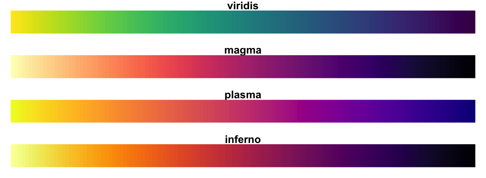

---
title: "ggplot"
author: "Rodrigo Negrete Pérez"
date: \today

theme: "CambridgeUS"
colortheme: 'beaver'
output: 
  beamer_presentation:
    slide_level: 2
    toc: true
---

```{r setup, include=FALSE}
knitr::opts_chunk$set(echo = TRUE)
library(tidyverse)
library(xtable)
options(xtable.comment = FALSE)
```

# Intro a ggplot

## Parte del tidyverse

* ggplot es parte del tidyverse
* Si bien R tiene gráficas base:
  + no son tan presonalizazbles
  + ggplot puede vincular estética a variable
* Ampliamente utilizado por su sintaxis 

## mtcars

* Usemos la tradicional base de datos de mtcars

```{r, cache=TRUE}
cars<- mpg
```

## 

```{r, cache=TRUE, results='asis', echo=FALSE}
xtable(head(cars))
```

# Sintaxis

## Sintaxis

```{r, eval=FALSE}
ggplot(data=<DATA>)+
  geom_<<funcion>>(mapping= aes(x= <<x>> , y= <<y>> ))
```

## ggplot()

* ggplot() crea un sistema de coordenadas al que va agregando capas

```{r, eval=FALSE}
ggplot()
```


##

```{r, echo=F, cache=TRUE}
ggplot()
```

## 

* Evidentemente, está vacío: hay que añadir capas
* El primer argumento es el data frame a utilizar
* Podemos omitir el data= por solo poner el df

## Geometría

* Podemos añadir una geometría en función del tipo de gráfico que queremos
* Define cómo las variables se van a mapear a una visualización
* i.e geom_point() añadiría un gráfico de puntos; geom_line() una línea, etc
* todas las geometrías incluyen un argumento de mapeo, aes(), que especifica qué variables son las que se van a mapear

## Ejemplo

* Intentemos graficar la relacion que existe entre el tamaño del motor (disp) y la eficiencia(hwy)

```{r, eval=FALSE}
ggplot(data=cars)+
  geom_point(mapping = aes(x= displ, y= hwy))
```

##

```{r, echo=FALSE}
ggplot(data=cars)+
  geom_point(mapping = aes(x= displ, y= hwy))
```

## 

* Podemos guardar las gráficas como objetos, solo que no las mostrará
* Si queremos que lo muestre, podemos encerrar el objeto entre paréntesis al momento de guardarlo

```{r, eval=FALSE}
(figura.1<- ggplot(data=cars)+
  geom_point(mapping = aes(x= displ, y= hwy)))
```

## Añadir elementos

* Podemos añadir elementos con un + elemento()
* Por ejemplo, si queremos añadir etiquetas para los ejes

```{r, eval=FALSE}
ggplot(data=cars)+
  geom_point(mapping = aes(x= displ, y= hwy))+
  xlab('Volumen Motor (l)')+
  ylab('Millas por galón')+
  ggtitle('Eficiencia')+
  theme_minimal()+
  coord_flip()
```

##

```{r, echo=FALSE}
(ggplot(data=cars)+
  geom_point(mapping = aes(x= displ, y= hwy))+
  xlab('Volumen Motor (l)')+
  ylab('Millas por galón')+
  ggtitle('Eficiencia')+
  theme_minimal()+
    coord_flip())
```

##

* Si ya tenemos la gráfica como objeto guardado, basta con poner el nombre del objeto seguido de los elementos

```{r, eval=FALSE}
(figura.1+ 
    xlab('Volumen Motor (l)')+
    ylab('Millas por galón')+
    ggtitle('Eficiencia')+
    theme_minimal()+
    coord_flip())
```


# Mapeos aestéticos


## Mapeos aestéticos

* Una de las virtudes de ggplot es poder vincular una característica estética a una variable
* Por ejemplo, podríamos vincular el tipo de vehículo con la forma y color de los puntos


```{r, eval=FALSE}
(aes<- ggplot(data=cars)+
  geom_point(mapping = aes(x= displ, y= hwy, 
                           color=class)))
```


##

```{r, echo=FALSE}
(aes<- ggplot(data=cars)+
  geom_point(mapping = aes(x= displ, y= hwy, 
                           color=class)))
```

##

* Lo que hace ggplot es asignar un nivel de color a cada categoría de coches
* El color asignado da información de la variable clase
* ggplot automáticamente añade una leyenda que muestra los niveles asignados

##

* Intentemos añadir formas

```{r, eval=FALSE}
(aes.2<- ggplot(data=cars)+
  geom_point(mapping = aes(x= displ, y= hwy, 
                           color=class, shape=class)))
```

##

```{r, echo=FALSE}
(aes.2<- ggplot(data=cars)+
  geom_point(mapping = aes(x= displ, y= hwy, 
                           color=class, shape=class)))
```

##

* Por default, ggplot tiene un número limitado de formas
* Omite la categoría para la que no alcanzó forma

## Dentro vs fuera de aes()

* Podemos poner color, forma , etc. fuera de la aestética
* Al hacerlo, estamos especificando a ggplot que queremos esa geometría en particular del color especificado 

```{r, eval=FALSE}
(fuera_aes<- ggplot(data=cars)+
  geom_point(mapping = aes(x= displ, y= hwy) , 
                           color= 'red'))
```

##

```{r, echo=F}
(fuera_aes<- ggplot(data=cars)+
  geom_point(mapping = aes(x= displ, y= hwy) , 
                           color= 'red'))
```

## alpha ##

* Podemos modificar la transparencia usando la aestética alpha

* Si lo ponemos fuera de aes() podemos especificar la transparencia de la geometría

```{r, eval=FALSE, warning=FALSE}
(aes.3<- ggplot(data=cars)+
    geom_point(mapping = aes(x= displ, y= hwy, 
                             color=class, alpha=class)))
```

## 

```{r, echo=FALSE, warning=FALSE}
(aes.3<- ggplot(data=cars)+
    geom_point(mapping = aes(x= displ, y= hwy, 
                             color=class, alpha=class)))
```


# Escalas de colores

## Escalas de colores

* Añadiendo un elemento podemos escoger la paleta de colores 

* Existen paquetes que con distintas paletas
* Al final , una variable (categórica o continua) va a estar vinculada a una paleta de nuestra elección

##

* Probemos con Viridis

```{r, warning=FALSE}
library(viridis)
```

* Todos los paquetes de paletas tienen múltiples gamas de colores a escoger
* Tendremos que especificar cual queremos

##



## 

* Repitamos nuestra primera gráfica con aestética de color, pero usando la paleta viridis

```{r, eval=FALSE}
(scale_color <- ggplot(data=cars)+
    geom_point(mapping = aes(x= displ, y= hwy,
                             color=class))+
    scale_color_viridis(discrete = T, 
                        option = 'magma'))
```

##

```{r, echo=FALSE}
(scale_color <- ggplot(data=cars)+
    geom_point(mapping = aes(x= displ, y= hwy,
                             color=class))+
    scale_color_viridis(discrete = T, 
                        option = 'magma'))
```


# Facets

## Facets

* Usando la aestética podemos mostrar en un mismo gráfico figuras para cada categoría
* Los facets sirven para mostrar una gráfica distinta para cada categoría
* Tratemos de hacer lo mismo de los colores, pero con facets


## 

```{r, eval=FALSE}
(facets <- ggplot(cars)+
    geom_point(mapping = 
                 aes(x= displ, y= hwy))+
    facet_wrap(~ class, nrow = 2))
```

* Debemos incluir la fórmula empezando por ~
  + La fórmula es la variable por la que vamos a descomponer las gráricas 
  
##

```{r, echo=FALSE}
(facets <- ggplot(cars)+
    geom_point(mapping = 
                 aes(x= displ, y= hwy))+
    facet_wrap(~ class, nrow = 2))
```

##

* Podemos hacer facets por más variables, cambiando la fórmula

```{r, eval=FALSE}
(facets <- ggplot(cars)+
    geom_point(mapping = 
                 aes(x= displ, y= hwy))+
    facet_wrap(cyl ~ class))
```

##

```{r, echo=FALSE}
(facets <- ggplot(cars)+
    geom_point(mapping = 
                 aes(x= displ, y= hwy))+
    facet_wrap(cyl ~ class))
```


# Otra sintaxis

## Otra sintaxis

* ggplot admite otra sintáxis que puede resultar más fácil

* Además, podemos omitir pedazos de los argumentos para que las gráficas tengan menos texto

* En particular, podemos incluir la estética dentro de ggplot() y dejar la geometría vacía

##

```{r, eval=FALSE}
(figura.1.2 <- ggplot(cars, 
                      aes(displ, hwy, color= class))+
   geom_point())
```

* Podemos omitir la x,y y el mapeo
* dejamos la geometría vacía y ponemos el mapeo en ggplot()
* Argumetos adicionales de la geometría se siguen especificando dentro (como la transparencia, forma o tipo de línea o punto)

##

```{r, echo=FALSE}
(figura.1.2 <- ggplot(cars, 
                      aes(displ, hwy, color= class))+
   geom_point())
```


# Múltiples geometrías

## Variedad de gráficos

* Existe una gran variedad de geometrías
* Si bien se añaden de la misma manera, requieren de argumentos o fórmulas distintas
* Veamos algunas, además de puntos y líneas:
  + Línea de regresión
  + Gráfico de barras
  + Histograma
  + Densidad

## geom_smooth()

* geom_smooth() añade la línea de regresión de las variables especificada. 
* Automáticamente añade intervalos de confianza

##

* Hagamos lo mismo, con una línea para cada tipo de tracción (drv), pues son menos categorías
```{r, eval=FALSE}
(smooth <- ggplot(cars)+
    geom_smooth(mapping = aes(
      x=displ, y= hwy,
      linetype= drv, color=drv
    )))
```

##

```{r, echo=FALSE}
(smooth <- ggplot(cars)+
    geom_smooth(mapping = aes(
      x=displ, y= hwy,
      linetype= drv, color=drv
    )))
```

## Múltiples geometrías

* Es común incluir las observaciones y la línea de regresión en el mismo gráfico
* Si utilizamos la sintaxis alternativa, es muy sencillo añadir múltiples geometrías

##

```{r, eval=FALSE}
(mult_geom <- ggplot(cars, 
                     aes(displ, hwy, 
                         color= drv,
                         linetype=drv))+
    geom_point()+
    geom_smooth())
```

* Lo común va dentro de ggplot() y lo que es propio de cada geometría va dentro de su respectiva geom

##

```{r, echo=FALSE, message=FALSE}
(mult_geom <- ggplot(cars, 
                     aes(displ, hwy,
                         color= drv, linetype=drv))+
    geom_point()+
    geom_smooth())
```

## 

* Podemos jugar con las configuraciones

```{r, eval=F}
(mult_geom.2 <- ggplot(mpg,
                       aes(displ, hwy))+
    geom_point(aes(color=class))+
    geom_smooth(data= filter(mpg,
                             class=='subcompact'), 
                color= 'red'))
```

##

```{r, echo=FALSE, message=FALSE, warning=FALSE}
(mult_geom.2 <- ggplot(mpg,
                       aes(displ, hwy))+
    geom_point(aes(color=class))+
    geom_smooth(data= filter(mpg,
                             class=='subcompact'), color= 'red'))
```

##

* Al incluir x y y en ggplot, compartirán las mismas variables
* Como color solo está en la aestética de point, solo los puntos varían de color de acuerdo con la categoría
* Usamos un subconjunto de datos para graficar la línea de regresión
* La línea es roja porque no está en la aestética y solo está en la geometría de la regresión

# Gráficos de barras

## Gráfico de barras

* Solo requerimos cambiar la geometría

```{r, eval=FALSE}
(bar <- ggplot(cars)+
  geom_bar(aes(class)))
```

##

```{r, echo=FALSE}
(bar <- ggplot(cars)+
  geom_bar(aes(class)))
```


## 

* Construyamos un df que haga más fácil ver lo que hace el gráfico

```{r}
cars_count <- cars %>% 
  group_by(class) %>% 
  summarise(n=n())
```

* ¿Cuál será el output?

##

```{r, results='asis', echo=FALSE}
xtable(cars_count)
```


## 

* ¿Por qué una sola variable? 
* Los gráficos de barras cuentan, pero esa cuenta no está explícita en el df, sino que ggplot lo calculó (e hizo algo análogo al df que creamos)
* El algoritmo que calcula un nuevo valor para la gráfica se llama stat
* Al hacer una gráfica de barras de esta manera, ggplot calcula dos nuevos valores, la cuenta y la proporcion
* El stat default para geom_bar() es 'count', de ahí que al solo poner la variable 'class' nos entregó la cuenta de las observaciones de cada clase

## Identity

* Podemos especificar el stat que queremos
* Por ejemplo, para hacer un gráfico de barras, sin que calcule otra cosa, usamos el stat='identity'
* Tomemos el df que hicimos

##

```{r, eval=FALSE}
(cars_count <- cars %>% 
  group_by(class) %>% 
  summarise(n=n()) %>% 
  ggplot(aes(class, n))+
  geom_bar(stat = 'identity'))
```

##

```{r, echo=FALSE}
(cars_count <- cars %>% 
  group_by(class) %>% 
  summarise(n=n()) %>% 
  ggplot(aes(class, n))+
  geom_bar(stat = 'identity'))
```

## stat='identity'

* Así, hacemos un gráfico tradicional: vinculamos una variable x a una y
* ggplot no calculó nada, sino que solo graficó dos variables preexistentes

## Barras de proporciones

* Para hacer un gráfico de barras, pero con porcentajes, tenemos que cambiar un poco el gráfico

```{r, eval=FALSE}
(bar_prop <- ggplot(cars)+
    geom_bar(aes(class, y=..prop..,
                 group=1)))
```
* ¿Qué pasa si no pongo la variable grupo?

##

```{r, echo=FALSE}
(bar_prop <- ggplot(cars)+
    geom_bar(aes(class, y=..prop..,
                 group=1)))
```

## fill vs color

* Así como con los gráficos pasados, podemos vincular el color a una variable

* Hagamos el mismo gráfico de barras de proporción, solo que, para cada clase, distinguir cuántos coches hay de cada tracción dentro de cada clase

##

```{r, eval=FALSE}
(bar_color <- ggplot(cars)+
    geom_bar(aes(class,
                 color=drv)))
```

##

```{r, echo=FALSE}
(bar_color <- ggplot(cars)+
    geom_bar(aes(class,
                 color=drv)))
```

## 

* En realidad, la aestética color solo modifica el borde
  + ¿Por qué funciononaba con líneas y puntos?
  
* Si queremos modificar el relleno, necesitamos usar la aestética fill

```{r, eval=FALSE}
(bar_fill <- ggplot(cars)+
    geom_bar(aes(class,
                 fill=drv)))
```

##

```{r, echo=FALSE}
(bar_fill <- ggplot(cars)+
    geom_bar(aes(class,
                 fill=drv)))

```


## position

* Por default, ggplot apiló las barras unas encima de las otras
* Es que el argumento *position* de la geometría es por default 'stack'
* Podemos cambiar las posiciones de las barras
* otras posiciones son 
  + position='fill'  las apila, pero hace las barras del mismo tamaño
  + position='dodge' pone las barras una al lado de la otra en pequeños grupos
  
## position='fill' 


```{r, eval=FALSE}
(bar_position_fill <- ggplot(cars)+
    geom_bar(aes(class,
                 fill=drv), position='fill'))
```

##

```{r, echo=FALSE}
(bar_position_fill <- ggplot(cars)+
    geom_bar(aes(class,
                 fill=drv), position='fill'))
```

## position='dodge' 


```{r, eval=FALSE}
(bar_position_dodge <- ggplot(cars)+
    geom_bar(aes(class,
                 fill=drv), position='dodge'))
```

##

```{r, echo=FALSE}
(bar_position_dodge <- ggplot(cars)+
    geom_bar(aes(class,
                 fill=drv), position='dodge'))
```

# Histograma y Densidad

* Para ilustrar el histograma y la densidad creemos un df de salarios de n trabajadores con
  + Una variable id
  + Una variable que identifique el género
  + su salario 
  
* Supongamos que

\[w_{Hi} \sim N(30000 ,3000) \]
\[w_{Mi} \sim N(24000 ,5000) \]

##

```{r, cache=TRUE}
set.seed(2022)

n <- 100
mean_h <- 30000
mean_m <- 24000
sd_h <- 3000
sd_m <- 5000


salarios <- tibble(
  id=seq(n),
  sexo= factor(rep(c('m','h'), each= n/2)),
  salario= round(c(rnorm(n/2, mean_m, sd_m),
                   rnorm(n/2, mean_h, sd_h)))
)

```

##

```{r, results='asis', echo=FALSE}
xtable(head(salarios))
```

## Densidad

* Hacemos la gráfica de densidad con geom_density()
* Como es densidad, solo necesitamos especificar una variable
* Añadamos una línea vértical que cruce en la media
* las líneas horizontales o verticales son una geometría en sí
  + geomvline() para líneas verticales
  + geomhline() para líneas horizontales
* Si queremos que el corte de la línea dependa de los datos, tenemos que agregar la media en la estética de geom_vline()

##

```{r, eval=FALSE}
(density <- ggplot(salarios,
                   aes(salario))+
    geom_density()+
    geom_vline(aes(xintercept=mean(salario))))
```

##

```{r, echo=FALSE}
(density <- ggplot(salarios,
                   aes(salario))+
    geom_density()+
    geom_vline(aes(xintercept=mean(salario))))
```

## Densidad por grupo

```{r, eval=FALSE}
(density_group <- ggplot(salarios,
                   aes(salario, color= sexo))+
    geom_density()+
    geom_vline(aes(xintercept=mean(salario)),
               color='red'))
```

##

```{r, echo=FALSE}
(density_group <- ggplot(salarios,
                   aes(salario, color= sexo))+
    geom_density()+
    geom_vline(aes(xintercept=mean(salario)),
               color='red'))
```


## Histograma ##

* Evidentemente, el histograma es muy similar a la densidad
* Podemos, además, especificar las marcas de clase 

  + bins= # ajusta el número de marcas de clase a las especificadas
  + binwidth= # crea las marcas de la longitud deseada
  
##

* Repliquemos lo mismo de la densidad, pero con el histograma
* Probemos primero con el número de marcas de clase

```{r, eval=FALSE}
(histogram_b <- ggplot(salarios, 
                     aes(salario))+
    geom_histogram(bins=10))

```

##

```{r, echo=FALSE}
(histogram_b <- ggplot(salarios, 
                     aes(salario))+
    geom_histogram(bins=10))

```

##

* Ahora con la longitud de clase

```{r, eval=FALSE}
(histogram_bwidth <- ggplot(salarios, 
                     aes(salario))+
    geom_histogram(binwidth = 5000))
```

##

```{r, echo=FALSE}
(histogram_bwidth <- ggplot(salarios, 
                     aes(salario))+
    geom_histogram(binwidth = 5000))
```

##

* Así como con la densidad, podemos distinguir por color

```{r, eval=FALSE}
(histogram_sexo <- 
    ggplot(salarios,
           aes(salario, color= sexo))+
    geom_histogram(binwidth = 2500, 
                   position= 'dodge',
                   fill='white'))
```

## 

```{r, echo=FALSE}
(histogram_sexo <- 
    ggplot(salarios,
           aes(salario, color= sexo))+
    geom_histogram(binwidth = 2500, 
                   position= 'dodge',
                   fill='white'))
```


# ggsave()

## ggsave()

* Los gráficos de ggplot() pueden guardarse como cualquier objeto
* Podemos guardar  nuestra gráfica generada como un archivo de formato de nuestra preferencia con ggsave()
* Ejecutarlo una y otra vez no genera un nuevo archivo, sino que lo sobreescribe
* Podemos modificar tamaño o escala

##
```{r, eval=FALSE}
ggsave(
  filename, # nombre para guardar
  plot = last_plot(), # grafica que va a guardar (ultima pred.)
  device = NULL, # formato
  path = NULL, # donde lo va a guardar
)
```

